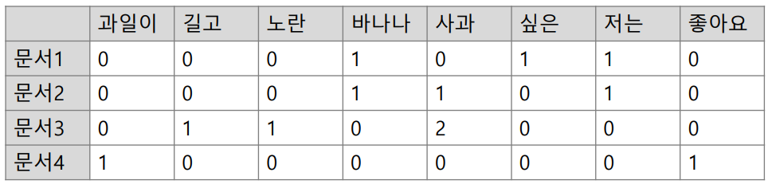

# 자연어 처리

목차

- [자연어 처리란?](#자연어-처리란)
- [자연어 처리 과정](#자연어-처리-과정)
  - [형태소 분석](#형태소-분석)
- [전처리 단계](#전처리-단계)
  - [토큰화](#토큰화)
  - [정제 (Cleaning)](#정제-cleaning)
  - [정규화 (Normalization)](#정규화-normalization)
  - [벡터화/수치화 (Vectorization)](#벡터화수치화-vectorization)
  - [패딩 (Padding)](#패딩-padding)

## 자연어 처리란?

### 코파일럿왈

1. 자연어 처리(Natural Language Processing, NLP)란 인간이 발화하는 언어 현상을 기계적으로 분석하고 처리하는 인공지능의 한 분야이다.

2. 자연어 처리는 컴퓨터가 인간의 언어를 이해하고 분석하는 데 사용되며, 기계 번역, 질문 응답 시스템, 정보 검색, 대화형 시스템 등 다양한 분야에 응용된다.

### 강의자료

1. 자연어 : 의사소통에 사용되는 언어

2. NLP : 자연어를 분석, 이해, 생성, 처리

### 영역

1. Machine Translation
2. Sentiment Analysis
3. Spam Filtering
4. Image Captioning
5. Text summarization
6. Question Answering
7. Dialogue Generation

## 자연어 처리 과정

### 형태소 분석

형태소 : 문장 구성의 최소 단위, **토큰** 형태로 형태소 이용

- 코퍼스 : 말뭉치 - 텍스트 묶음 (예: 소설, 뉴스기사, 위키 등)

- 토큰 : 분석하고자 하는 단위 (문장 or 단어)

- 어휘 집합 : 처리하는 문제 영역의 전체 단어 집합 (단어장)

분석 : 어간추출, 원형 복원, 품사 부착

활용 : 기계 번역, 텍스트 마이닝

## 전처리 단계

### 토큰화

말뭉치를 토큰으로 나누는 작업

품사 태깅 POS(Part of Speech) Tagging

### 정제 (Cleaning)

토큰화 작업 후 불필요한 토큰을 제거하는 작업

- 노이즈 : 특수문자, 불용어, 불필요한 단어

- 방법 : 불용어 제거, 빈도 기반 제거, 짧은 단어 제거

- 완벽한 정제는 어려움 (특히 한국어)

### 정규화 (Normalization)

- 단어를 통합 시키는 것

- 대소문자 통합, 같은 의미 통합 (예 : USA, US), 단위 통합, 의미론적 기반 단어 원형 추출

### 벡터화/수치화 (Vectorization)

- 컴퓨터가 이해할 수 있는 형태로 변환

- 정수 인코딩, 원핫 인코딩, 단어 분리

- One-hot encoding, Word2Vec, GloVe, FastText

### 패딩 (Padding)

- 길이가 서로 다를 때 같은 길이로 맞추는 작업

오후 수업

## NLP Methods : 자연어 처리 방법

### 언어 모델 : Language Model (LM)

언어의 확률적 구조를 모델링

- 문장의 확률을 예측

- 통계적 언어 모델 -> 기계 학습 언어 모델 (RNN, LSTM, Transformer)

확률 할당 이유 :

1. 기계 번역

2. 오타 교정 : P(달린다) > P(달리는다)

3. 음성 인식 : P(나는 밥을 먹는다) > P(나는 방을 먹는다)

-> 둘 중 더 확률이 높은 단어를 선택

### 통계적 언어 모델 : Statistical Language Model (SLM)

조건부 확률 (Conditional Probability) :

- A가 일어난 상황에서 B가 일어날 확률 : P(B|A) (교집합)

  - P(B|A) = P(A, B) / P(A)

  - 예 : P(나는 밥을 먹는다) = P(나는) _ P(밥을) _ P(먹는다)

  - 문제 : 희소(sparsity) 문제 - 특정 단어의 조합이 없을 수 있음

### N-gram

문장을 n개의 단어로 끊어서 확률을 계산 , n개의 단어만 묶어서 판단

- 문제 : n이 커질수록 희소 문제 심화

### 텍스트 수치 표현 Text Representation

국소/이산 표현 (local/discrete)

분산/연속 표현 (Discributed/Continuous)

## BOW(Bag of Words)

수치화 표현 후 통계적 접근 방법

    [[0 1 1 1 0 0 1 0 1]
    [0 2 0 1 0 1 1 0 1]
    [1 0 0 1 1 0 1 1 1]
    [0 1 1 1 0 0 1 0 1]]

방법 :

1. 단어장 생성
2. 단어 토큰의 등장 횟수를 기록한 벡터 생성

예시 : 각 단어를 인덱스로 표현, 단어가 등장하면 해당 인덱스의 값을 1 증가

### sklearn CountVectorizee

단어 빈도를 count (길이 2 이상)

띄어쓰기만 기준 : 낮은 수준의 토큰화

## DTM (Document-Term Matrix)

- 문서 단어 행렬

- 문서와 단어의 관계를 행렬로 표현

- 한계 : 중요도 고려하지 않음, 대부분 0으로(희소 표현)

## TF-IDF(Term Frequency-Inverse Document Frequency)

### 단어 빈도 (Term Frequency)

- 문서에서 단어가 나타나는 빈도 : 무조건 많이 나오는 게 좋은 건 아니다

- 부분별 특정 단어의 등장 횟수를 파악

  - TF = (특정 단어 등장 횟수) / (문서 내 전체 단어 등장 횟수)

- 방법 :

  1. DTM 생성

  2. 가중치 부여

