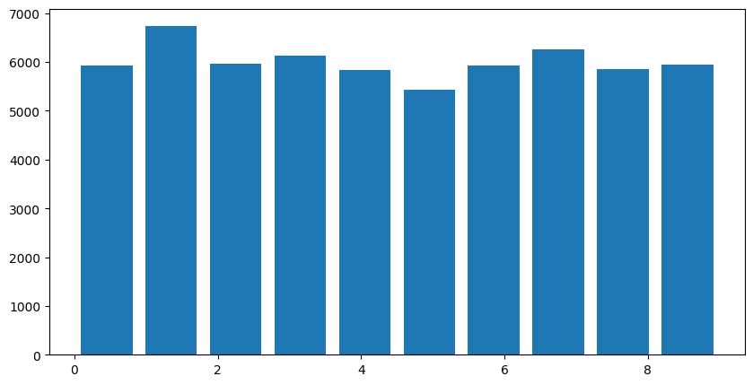
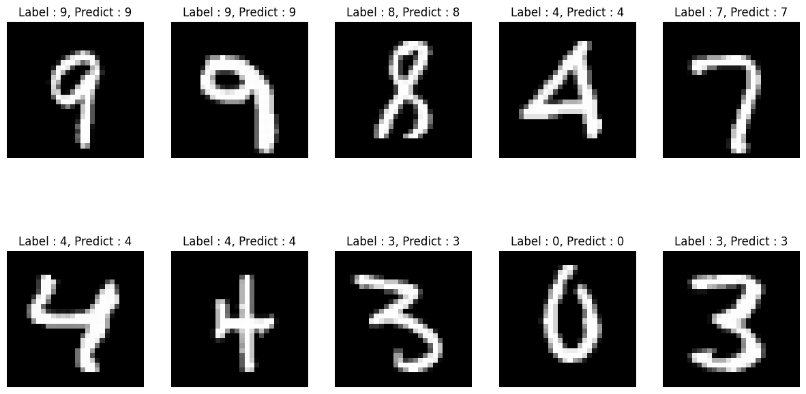
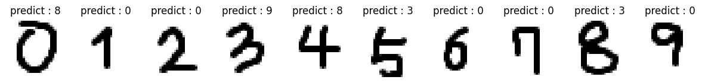
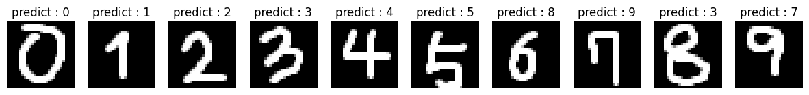

# OpenCV 다루기

## 목차

- [그림 그리기](#그림-그리기)
- [얼굴인식](#얼굴-인식)
- [TorchVision](#torchvision)
- [CNN 이미지 인식](#cnn-이미지-인식)

  - [구성](#구성)
  - [모델 작성](#모델-작성)
  - [데이터 증강 Data Augmentation](#데이터-증강-data-augmentation)
  - [IMAGE DATASET](#image-dataset)
  - [CNN - CIFAR10](#cnn---cifar10)

- [Assignment_CNN](#assignment_cnn)

## 그림 그리기

[B01_open_cv.ipynb](B01_open_cv.ipynb)

0. 기본적인 cv2 사용법

    - cv2.imread() : 이미지 파일을 읽어옴
    - cv2.imshow() : 이미지를 화면에 출력
    - cv2.waitKey() : 키보드 입력을 기다림
    - cv2.destroyAllWindows() : 모든 창을 닫음
    - 핑구.png

1. 그림 파일 출력

    ```python
    import cv2
    img = cv2.imread('filename.jpg', cv2.IMREAD_COLOR)
    cv2.imshow('image', img)
    cv2.waitKey(0)
    cv2.destroyAllWindows()
    ```

2. 그림 그리기

    1) 직선 그리기

        ```python
        cv2.line(img, start, end, color, thickness)
        ```

    2) 사각형 그리기

        ```python
        cv2.rectangle(img, start, end, color, thickness)
        ```

    3) 원 그리기

        ```python
        cv2.circle(img, center, radius, color, thickness)
        ```

    4) 타원 그리기

        ```python
        cv2.ellipse(img, center, axes, angle, startAngle, endAngle, color, thickness)
        ```

    5) 다각형 그리기

        ```python
        cv2.polylines(img, points, isClosed, color, thickness)
        ```

    6) 단어 입력

        ```python
        cv2.putText(img, text, org, font, fontScale, color)
        ```

3. 그림 파일 저장하기

    ```python
    cv2.imwrite('filename.jpg', img)
    ```

## 얼굴 인식

[B02_Face_Detection.ipynb](B02_Face_Detection.ipynb)

1. 얼굴 인식 클래스 : cv2.CascadeClassifier
    - 모델 파일 : haarcascade_frontalface_default.xml
    - 얼굴 검출 : detectMultiScale(image, scaleFactor, minNeighbors, flags, minSize, maxSize)

2. 눈 인식 클래스도 있음 : haarcascade_eye.xml

## TorchVision

1. 파이토치에서 제공하는 이미지 데이터셋 패키지

2. ImageNet, CIFAR10, MNIST 등 다양한 데이터셋 제공

3. image dataset

    ```python
    import torch
    import torchvision
    from torchvision.transforms import ToTensor, Lambda

    ds = torchvision.datasets.MNIST(
        root='./data',
        train=True,
        transform=ToTensor(),
        download=True,
        target_transform=Lambda(lambda y: torch.zeros(10, dtype=torch.float).scatter_(0, torch.tensor(y), value=1))
    )
    ```

## CNN 이미지 인식

1. DNN의 한계 : 실제 이미지보다 배경 데이터가 더 많다

2. CNN의 개념
    - Convolutional Neural Network : 이미지 인식에 특화된 신경망
    - Convolution : 이미지의 특징을 추출; 얼굴 인식처럼 ROI를 추출

3. Convolution Layer
    - 이미지의 특징을 추출하는 계층
    - (0,0)부터 시작하여 필터를 이동시키면서 특징을 추출
    - 주요 특징만 추출 -> 1차원으로 Linear에 전달

    3-1. 구성  
    1) 커널/필터/마스크 : 3x3, 5x5의 이미지 위를 이동하는 행렬
    
    2) 스트라이드 : 필터 이동 방향 및 크기; 왼쪽에서 오른쪽으로 1 픽셀 씩 이동 (3x3 or 5x5 기준 1)
    - grayscale 이미지 : 1채널
        - 가중합을 한 픽셀로 출력
    - RGB 이미지 : 3채널
        - 3개의 필터로 각 채널을 합산하여 출력
    
    - Padding : 이미지의 테두리를 0으로 채워서 이미지 크기를 유지
        - 모서리의 이미지의 특징을 유지하기 위해 사용
        - valid : 입력과 출력 이미지의 크기가 다르게 패딩
        - same : 출력 이미지와 입력 이미지의 크기가 같도록 패딩 (0)

## 구성

### 1. 차원

1) Conv1D : 1차원 데이터의 특징 추출

    - 시간을 축으로 좌우로만 이동
2) Conv2D : 2차원 데이터의 특징 추출
    - 똑같이 좌우로 이동, 합성곱
3) Conv3D : 3차원 데이터의 특징 추출
    - 동영상 데이터의 특징 추출

### 2. Pooling Layer : resize 역할

- Convolution Layer의 출력 이미지를 입력으로 받아 크기를 줄이는 역할
- Max Pooling : 최대값을 추출
- Average Pooling : 평균값을 추출

- 보통 2x2로 설정

### 3. Flatten Layer : 1차원으로 변환

- Convolution Layer의 출력 이미지를 1차원으로 변환

=> input -> Convolution -> Pooling -> Flatten -> Dense(얘는 뭐지) -> output

## 모델 작성

```python
    def __init__(self):
        """
        Initializes a new instance of the class.
        """
        super(Net, self).__init__()     # 상속받은 클래스의 생성자 호출
        self.conv1 = nn.Conv2d(3, 16, kernel_size=3, padding=1) 
                            # 3채널 입력, 16채널 출력, 3x3 커널, 패딩 1
        self.act1 = nn.tanh()           # 활성화 함수
        self.pool1 = nn.MaxPool2d(2)    # 2x2 Max Pooling
        self.conv2 = nn.Conv2d(16, 8, kernel_size=3, padding=1)
        self.act2 = nn.tanh()
        self.pool2 = nn.MaxPool2d(2)
        self.fc1 = nn.Linear(8 * 8 * 8, 32)  # 8x8x8 입력, 32 출력
        self.act3 = nn.tanh()
        self.fc2 = nn.Linear(32, 2)          # 32 입력, 2 출력
        

    def forward(self, x):
        """
        Defines the computation performed at every call.
        """
        out = self.pool1(self.act1(self.conv1(x)))  # Conv1 -> Act1 -> Pool1
        out = self.pool2(self.act2(self.conv2(out)))  # Conv2 -> Act2 -> Pool2
        out = out.view(-1, 8 * 8 * 8)  # Flatten
        out = self.act3(self.fc1(out))  # FC1 -> Act3
        out = self.fc2(out)  # FC2
        return out
```

## 데이터 증강 Data Augmentation

=> 모델 과적합 방지

- 데이터 증강은 기존의 데이터를 회전, 확대, 축소, 반전 등을 통해 데이터의 양을 늘리는 방법
- 데이터의 양을 늘리면 모델의 성능을 높일 수 있음
- torchvision.transforms 모듈을 사용하여 데이터 증강을 쉽게 할 수 있음

## IMAGE DATASET

[PyTorch Vision Datasets](https://pytorch.org/vision/stable/datasets.html)

- torchvision.datasets.MNIST

```python
    ds = torchvision.datasets.MNIST(
        root='./data',
        train=True,
        transform=transforms.ToTensor(),
        download=True
    )

    # root      : 데이터셋이 저장될 루트 디렉토리
    # train     : True면 훈련 데이터셋, False면 테스트 데이터셋을 불러옴
    # transform : 데이터 전처리; Compose를 사용하여 여러 전처리를 묶어줄 수 있음
                  알아서 전처리를 해준다!!
    # target_transform : 타겟 전처리; 원하는 라벨로 바꿔줄 수 있음
    # download  : True면 인터넷에서 데이터셋을 다운로드
```

- CIFAR10에서도 가능!

```python
ds = torchvision.datasets.CIFAR10(
    root='./data',
    train=True,
    transform=transforms.ToTensor(),
    download=True
)
```

## CNN - CIFAR10

- CIFAR10 데이터셋을 사용하여 CNN 모델을 학습

### 과정

1. 모듈 로딩
2. 디바이스 설정

    ```python
    DEVICE = 'cuda' if torch.cuda.is_available() else 'cpu'
    ```

3. 데이터 준비

    ```python
    # 데이터 다운로드
    ```

4. 모델 설계

    ```python
    class CNN(nn.Module):
    def __init__(self):
        super(CNN, self).__init__()
        self.conv1 = nn.Conv2d(in_channels = 3, out_channels = 8, kernel_size = 3, padding = 1)
        self.conv2 = nn.Conv2d(in_channels = 8, out_channels = 16, kernel_size = 3, padding = 1)
        self.pool = nn.MaxPool2d(kernel_size = 2, stride = 2)
        self.fc1 = nn.Linear(8 * 8 * 16, 64)
        self.fc2 = nn.Linear(64, 32)
        self.fc3 = nn.Linear(32, 10)

        # shape 조정이 제일 중요 : 
        # 32 * 32 * 3 -> 32 * 32 * 8 -> 16 * 16 * 8 -> 16 * 16 * 16 -> 8 * 8 * 16 -> 64 -> 32 -> 10

    def forward(self, x):
        x = F.relu(self.conv1(x))
        x = self.pool(x)
        x = F.relu(self.conv2(x))
        x = self.pool(x)
        x = x.view(-1, 8 * 8 * 16)
        x = F.relu(self.fc1(x))
        x = F.relu(self.fc2(x))
        x = F.log_softmax(self.fc3(x))
        return x
    ```

    - 훨씬 간결한 친구가 있었다....

    ```python
    # 모듈 동일
    class CNN(nn.Module):
    def __init__(self):
        super(CNN, self).__init__()
        self.conv1 = nn.Conv2d(3, 16, kernel_size=3, padding = 1)
        self.conv2 = nn.Conv2d(16, 32, kernel_size=3, padding = 1)
        self.fc1 = nn.Linear(8 * 8 * 8, 32)
        self.fc2 = nn.Linear(32, 2)

    def forward(self, x):
        out = self.max_pool2d(torch.tanh(self.conv1(x)),2)
        out = self.max_pool2d(torch.tanh(self.conv2(out)),2)
        out = out.view(-1, 8 * 8 * 8)
        out = torch.tanh(self.fc1(out))
        out = self.fc2(out)
        return out
    ```

5. 학습

```python
        # 학습 준비
        model = CNN().to(DEVICE)
        optimizer = torch.optim.Adam(model.parameters(), lr = 0.001)
        criterion = nn.CrossEntropyLoss()
        print(model)

        # 학습 함수 : 학습 데이터에 대한 모델 성능 확인
        def train(epoch, model, train_loader, optimizer, log_interval):
        model.train()
        for batch_idx, (image, label) in enumerate(train_loader):
            image = image.to(DEVICE)
            label = label.to(DEVICE)
            optimizer.zero_grad()
            output = model(image)
            loss = criterion(output, label)
            loss.backward()
            optimizer.step()

        if batch_idx % log_interval == 0:
            print(f"Train Epoch: {epoch} [{batch_idx}]\tTrain Loss: {loss.item():.6f}")

        # 검증 함수 : 학습이 잘 되고 있는지 확인
        def evaluate(model, test_loader):
        model.eval()
        test_loss = 0
        correct = 0

        with torch.no_grad():
            for image, label in test_loader:
                image = image.to(DEVICE)
                label = label.to(DEVICE)
            
            output = model(image)
            test_loss += criterion(output, label).item()
            prediction = output.max(1, keepdim = True)[1]
            correct += prediction.eq(label.view_as(prediction)).sum().item()
    
        test_loss /= len(test_loader.dataset)
        test_accuracy = 100. * correct / len(test_loader.dataset)
        return test_loss, test_accuracy

        # 학습 시작
        EPOCHS = 10
        for epoch in range(1, EPOCHS + 1):

            train(epoch, model, train_loader, optimizer, log_interval = 200)
            test_loss, test_accuracy = evaluate(model, test_loader)
            
            print(f"\n[EPOCH: {epoch}], \tTest Loss: {test_loss:.4f}, \tTest Accuracy: {test_accuracy:.2f} % \n")

        # 결과 : 
        [EPOCH: 10], Test Loss: 0.0342, Test Accuracy: 61.77 %
```

# Assignment_CNN

[Assignment_CNN.ipynb](BA01_cnn.ipynb)

- MNIST 데이터셋을 사용하여 CNN 모델을 학습
  - Data : mnist_784
  - DataLoader : Batchs = 128
  - Model : CNN
  - Optimizer : Adam
  - Loss : CrossEntropyLoss
  - Epochs : 10

## 과제 목차

1. 모듈 로딩

2. 데이터 준비

    ```python
    from torchvision import datasets
    from torchvision.transforms import ToTensor, Lambda

    ds = datasets.MNIST(
        root='mnist_784',
        train=True,
        transform=ToTensor(),
        download=True
    )
    ```

   2-1. 클래스 분포 확인 : histogram 활용

    
    -> 0~9까지의 숫자가 균등하게 분포, accuracy 활용 가능

    2-2. DataLoader 생성

    ```python
    from torch.utils.data import DataLoader
    Batchs = 128
    seed = torch.Generator().manual_seed(11)
    train_loader = DataLoader(ds, batch_size=Batchs, shuffle=True, generator=seed)
    # test는 data_loader 할 필요 없음
    ```

3. 모델 설계

    ```python
    # 1. Load Module
    from torch import nn
    import torch.nn.functional as F

    # 2. Create CNN Model
    class CNN(nn.Module):
        def __init__(self):
            super(CNN, self).__init__()
            self.conv1 = nn.Conv2d(1, 16, kernel_size=3, padding = 1) 
            self.conv2 = nn.Conv2d(16, 32, kernel_size=3, padding = 1)
            self.fc1 = nn.Linear(7 * 7 * 32, 32)
            self.fc2 = nn.Linear(32, 10)     
            self.max_pool2d = nn.MaxPool2d(2)
            self.tanh = nn.Tanh()
            
        def forward(self, x):
            out = self.conv1(x)                         # '1' x 28 x 28 -> '16' x 28 x 28
            out = self.max_pool2d(self.tanh(out))       # 16 x '28' x '28' -> 16 x '14' x '14'
            out = self.conv2(out)                       # '16' x 14 x 14 -> '32' x 14 x 14
            out = self.max_pool2d(self.tanh(out))       # 32 x '14' x '14' -> 32 x '7' x '7'
            out = out.view(-1, 7 * 7 * 32)              # 32 x 7 x 7 -> 1 x 1568 (= 32 x 7 x 7)
            out = self.tanh(self.fc1(out))              # 1568 -> 32
            out = self.fc2(out)                         # 32 -> 10
            return out
        ```

4. 학습

    ```python
    # 1. Create training function
    model = CNN()
    optimizer = torch.optim.Adam(model.parameters(), lr=0.001)
    loss_fn = nn.CrossEntropyLoss()

    def training(dataloader, model, loss_fn, optimizer):
        model.train()
        for batch_idx, (image, label) in enumerate(dataloader):
            optimizer.zero_grad()   # gradient 초기화
            output = model(image)   # forward
            loss = loss_fn(output, label)  # loss 계산
            loss.backward()         # backword
            optimizer.step()        # update
            
            if batch_idx % 100 == 0:
                print(f"batch {batch_idx}, loss {loss.item():.5f}")
    
    # Function test : train_dataloader
    # training(train_dataloader, model, loss_fn, optimizer)
    ```

5. 평가 함수 : Accuracy

    ```python
    from torchmetrics.functional import accuracy

    def evaluate(model, test_dataloader):
        model.eval()
        with torch.no_grad():
            for batch_idx, (image, label) in enumerate(test_dataloader):
                output = model(image)
                loss =  loss_fn(output, label).item()
                acc = accuracy(output, label, task='multiclass', num_classes=10)
                
                # 교재 : predicts.eq(label.view_as(predicts)).sum().item()
                #   - eq : element-wise 비교
                #   - view_as : label을 predicts의 shape로 변환
                
                if batch_idx % 30 == 0:
                    print(f"batch {batch_idx}, loss {loss:.5f}, accuracy {acc:.5f}")
                
        return loss, acc
    ```

    ```python
    # Function test : test_dataloader
    # loss, acc = evaluate(model, test_dataloader)
    # print(f"loss {loss:.5f}, accuracy {acc:.2f}")
    ```

6. 학습 시작

    ```python
    Epochs = 10
    model = CNN()
    optimizer = torch.optim.Adam(model.parameters(), lr=0.001)
    loss_fn = nn.CrossEntropyLoss()

    for epoch in range(1, Epochs+1):
        print(f"Epoch {epoch}")
        training(train_dataloader, model, loss_fn, optimizer)
        loss, acc = evaluate(model, test_dataloader)
        print(f"loss {loss:.5f}, accuracy {acc:.2f}")
        print("===========================================")
    ```

7. 예측

    ```python
    # 1. new data : 직접 그린 0~9의 그림 (28 * 28)
    import cv2

    # 2. Load Image : '../DATA/exams/Numbers/' 내의 모든 이미지 파일 검사
    import os
    import numpy as np

    path = '../DATA/exams/Numbers/'
    files = os.listdir(path)
    files = [file for file in files if file.endswith('.png')]
    ```

- 기존 파일로 테스트

    ```python
    # test_dataloader 중 10개의 이미지를 가져와 예측
    fig, ax = plt.subplots(2, 5, figsize=(15, 8))
    for idx, (data, target) in enumerate(test_dataloader):
        if idx == 10:
            break
        image = data[0].numpy().reshape(28, 28)
        pred = model(data[0])
        ax[idx//5, idx%5].imshow(image, cmap='gray')
        ax[idx//5, idx%5].set_title(f"Label : {target[0]}, Predict : {pred.argmax().item()}")
        ax[idx//5, idx%5].axis('off')
    plt.show()
    ```

- 직접 그린 숫자로 테스트

    ```python
    # Predict 진행
    model.eval()
    with torch.no_grad():
        plt.figure(figsize=(15, 5))
        for idx, file in enumerate(files):
            img = cv2.imread(path + file, cv2.IMREAD_GRAYSCALE)
            img = cv2.resize(img, (28, 28))
            # plt.imshow(img, cmap='gray')
            # plt.show()
            img = torch.tensor(img, dtype=torch.float32).view(1,1,28, 28)
            output = model(img)
            pred = output.argmax(dim = 1)
            print(f"file : {file}, predict : {pred.item()}")
            plt.subplot(1, len(files), idx+1)
            plt.imshow(img[0][0], cmap='gray')
            plt.title(f"predict : {pred.item()}")
            plt.axis('off')
        plt.show()
    ```

## 결과

1. test_dataloader 결과

    

2. 직접 그린 숫자 결과

    

    

### 결과 분석

- test_dataloader 결과 : 10개의 이미지를 가져와 예측
  - 0~9까지의 숫자를 잘 예측함

- 직접 그린 숫자 결과 : 0/10...
  - 흑백 반전을 통해 예측률을 높일 수 있음! 6/10
    - 그래도 0~5까지는 잘 예측하지만 6~9는 예측이 잘 안됨
