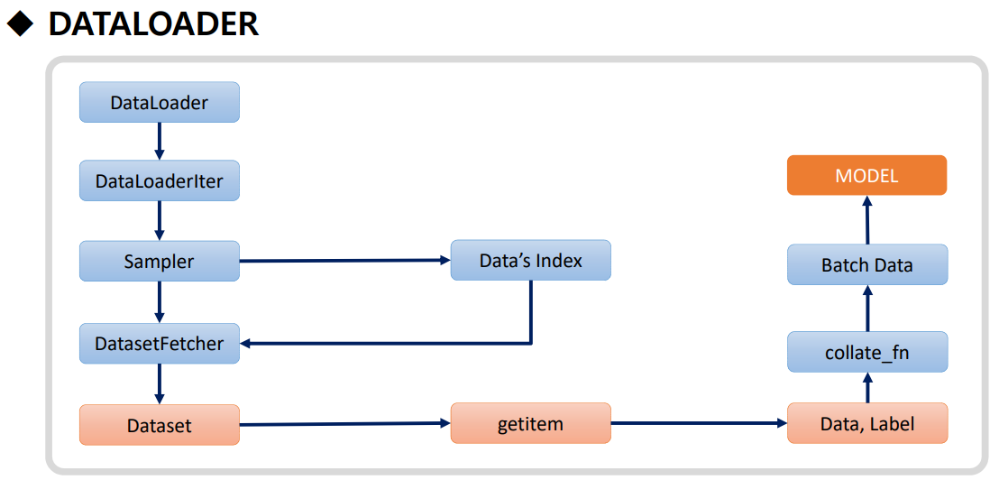

# 오전 수업

1. iris 데이터, DNN 모델 생성 설계

   - 데이터 구조 : 4개, 라벨 1개
   - 모델 구조 : 입력층, 은닉층, 출력층

   ```python
   - 입력층 : Linear(  ,  )    # (피처 수, 은닉 in) 4, 12
                               # w 개수 : 피처 수 * 은닉 in = 4 * 12 = 48

   - 은닉층 : Linear(  ,  )    # (은닉 in, 은닉 out) 12, 8
                               # w 개수 : 은닉 in * 은닉 out = 12 * 8 = 96
   - 출력층 : Linear(  ,  )    # (은닉 out, 라벨 종류 수)  8, 3
                               # w 개수 : 은닉 out * 라벨 종류 수 = 8 * 3 = 24


   입력층 : [1, 2, 3, 4] -> 12개 노드 : 각 "W11*1 + W12*2 + W13*3 + W14*4 + b" 생성 => 활성화 함수
                                       => W11 ~ W14 * 12 = 48개, b 12개

   => 은닉층 : W1 + W2 + W3 + W4 + ... + W11 + W112 -> 8개 노드 : 각 "W1 + W2 + ... W7 + W8 + b" 생성 => 활성화 함수
                                       => W11 ~ W112 * 8 = 96개, b 8개
   ```

2. 다중분류 : softmax() => 확률값으로 변환, 가장 큰 값 선택 (argmax) : 따라서 출력층 수는 클래스 수
3. 이진분류 : sigmoid() => 0.5 기준으로 0, 1로 변환 : 따라서 출력층 수는 1
4. [New!] 회귀 : Linear() => 연속된 값으로 출력 : 따라서 출력층 수는 1 (단, 출력층 활성화 함수 없음 : 예측값 그대로 출력)

5. Linear class :

    - 모든 입력 데이터와 가중치를 곱한 후 합계 계산
    - 전 결합층 (Fully Connected Layer) : 모든 입력 데이터가 모든 노드에 연결되어 있는 층
    - (Batch, 1_data)가 입력 (1_data = data.view(-1) : 1차원으로 변환)
    - 예시 : 28*28 이미지, 3 채널, 120 batch_size  

        ```markdown
        (120, 28, 28, 3) -> (120, 2352) : 28*28*3 = 2352
        (120, 2352) * (2352, 512) = (120, 512) : 2352개의 가중치, 512개의 노드  
        (120, 512) \* (512, 10) = (120, 10) : 512개의 가중치, 10개의 노드  
        (120, 10) -> (120, 10) : 10개의 노드, 10개의 클래스
        ```

    ===== Linear의 한계 : 선형(1차원) 정보로 이미지를 분석하기는 어렵다 =====

6. nn.Conv2d class :

    - 이미지에 픽셀과 커널의 가중치를 곱함 -> 특징 추출 - 얘는 학습하지 않음
    - 전체 이미지에서 특정 부분만 추출 (3x3) -> 합성곱 => 얘를 학습
    - 여러 커널을 활용 : 더 다양한 결과로 정확한 분류 가능
                         커널의 결과 => Linear 노드

    <Conv2d의 파라미터>

    1. 커널 : (3x3)을 기본으로 하는, 이동하며 특징을 스캔하는 필터
            가중치는 커널 수만큼 존재

    2. Stride : 커널이 이동하는 간격
               Stride = 1 : 한 칸씩 이동

    3. Padding :
        - 이미지 가장자리는 커널이 1번만 지나간다 => 정보 손실
        - 따라서 가장자리에 0을 추가하는 파라미터
        - Padding mode : zero, reflect, replicate
        - (28 x 28) -> (30 x 30) : 2만큼 패딩
            - valid, same : valid는 패딩 없음, same은 패딩 있음
            - int or tuple(a, b) : a는 위아래, b는 좌우 패딩
            - (50, 50) -> kernel=(4,2) -> (53, 51)

    - (120, 28, 28, 3) -> 필터 커널 (얘가 가중치 보유) => Conv2d의 노드

## [ =========== 오후 수업 ============= ]

## ML

1. KNN : 비슷한 데이터를 찾아서 예측하는 방법

   - 거리 측정, 수식 없음 => 게이른 학습

2. Linear Regression : 선형 분포 데이터를 예측하는 방법

   - Ridge : L2 규제 => 과적합 방지
   - Lasso : L1 규제 => 변수 선택
   - Logistic : 분류

3. SVM : 결정 경계(Support Vector)를 찾아서 예측하는 방법

   - 커널 기법 : 비선형 데이터를 선형으로 분류
     => 문제 : if 많은 피처 + 비슷한 중요도 => 과적합

4. Decision Tree : 의사결정 나무

   - 과적합 방지 : 가지치기
   - Feature Importance : 중요 변수 추출
     => 문제 : 과적합 (해결 : Random Forest)

5. Ensemble : 여러 모델을 결합해서 예측하는 방법

   - Random Forest : Decision Tree의 앙상블
   - Boosting : 약한 모델을 결합해서 예측
     - Gradient Boosting : 오차를 보정해서 예측
     - XGBoost : Gradient Boosting의 앙상블
   - Stacking : 여러 모델을 결합해서 예측
   - Voting : 여러 모델을 결합해서 예측

6. Perceptron : 뉴런 동작 기반 => 이진 분류
   - ANN : 인공신경망
   - DNN : 심층신경망 => Linear Regression
   - CNN : 합성곱신경망 => 이미지 분류
   - RNN : 순환신경망 => 자연어 처리

## ANN

1. 원리 : 대량의 데이터 -> 학습 -> 예측

2. 문제 => 해결
   - 많은 메모리 필요 => 데이터 양 조절
   - 많은 연산 => 데이터 양 조절
   - 많은 시간 필요 => 개선 없으면 학습 중단

## DataSet

1. 개념

   - Dataset : 피처와 라벨을 텐서화, 묶음으로 관리
   - DataLoader : Dataset을 미니배치로 관리

2. 구성

   - torch.utils.data.Dataset : 데이터셋의 부모 클래스; 커스텀 데이터셋을 만들 때 상속
     - 필수 오버라이딩 : `__init__`, `__len__`, `__getitem__`
   - torch.utils.data.DataLoader : 지정된 개수의 데이터를 미니배치로 묶어서 반환

3. DataLoader

   1. 구성 : Epoch, Batch Size, Iteration
   2. 진행 과정
      

      1. DataLoader : 데이터셋을 배치 크기로 나눔

      2. DataLoaderIter : DataLoader를 이터레이터로 변환

      3. Batch Sampler : 데이터셋을 배치로 나눔

         - Data's index : 인덱싱

      4. Datafetcher :

      5. Dataset

      6. getitem

      7. Data, Label

      8. collate_fn : 데이터를 묶음

      9. Batch Data : 묶은 데이터

      10. Model : 모델에 데이터를 입력

4. Datasampler

   [Pytorch > Docs > utils.data.sampler link](https://pytorch.org/docs/stable/_modules/torch/utils/data/sampler.html#WeightedRandomSampler)

   - RandomSampler : 무작위로 데이터를 추출

    ```python
    class WeightedRandomSampler(sampler, weights, replacement=False, num_samples=None):
      - sampler : 데이터셋
      - weights : 가중치
      - replacement : 중복 허용 여부 (True : 중복 허용)
      - num_samples : 샘플 수
    
    >>> list(WeightedRandomSampler([0.1, 0.9, 0.4, 0.7, 3.0, 0.6], 5, replacement=True))
    [4, 4, 1, 4, 5]
    >>> list(WeightedRandomSampler([0.9, 0.4, 0.05, 0.2, 0.3, 0.1], 5, replacement=False))
    [0, 1, 4, 3, 2]
    ```

    ㅣ 활용 : 데이터 불균형 문제 해결; ramdom_split의 **stratify** 기능
