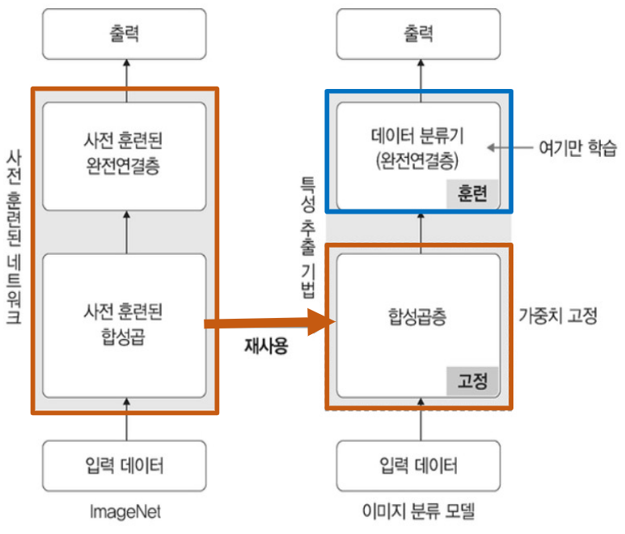

# 오전 수업

## 목차

[목차](#목차)   # 테스트용

## 전이학습 (Transfer Learning)

### 개요

1. CNN 딥러닝은 많은 데이터가 필요하다

    - 이미 학습된 모델을 사용하기! -> 전이학습(Transfer Learning)

2. 전이학습 : 특정 대상을 예측하도록 훈련된 모델을 다른 대상에 사용하는 것

### 방법

특성추출(Feature Extraction)

- 기존 학습된 모델을 가져와 마지막 완전연결층 부분만 새로 생성

- 학습 시 완전연결층만 학습, 나머지 계측들은 학습하지 않음



### 모델 역할 분류

1. Backbone Network

    - 기존 학습된 모델 (=base model)

    - 이미지의 특성(feature map)을 추출하는 역할

    - 대표 : VGG, ResNet, Inception, MobileNet, DenseNet

2. Neck

    - Backbone과 Head를 연결하는 역할

    - feature map을 정제, 재구성하는 역할

    - 대표 : FPN, PAN, ASPP

3. Head

    - 최종 예측을 수행하는 역할

    - feature map의 location 및 classifcation을 수행

    - 하나의 이미지에서 여러 객체를 효과적으로 탐지

    - 대표 : FCN, SSD, YOLO, Faster R-CNN

### 장점

1. 빠른 학습 수행

    - 특징 추출이 빠르고 별도의 학습이 필요 없음

2. 작은 데이터셋에도 효과적 : 과적합 예방

    - 마지막 완전연결층만 학습하기 때문에 가중치 수가 줄어 과한 학습이 이뤄지지 않음

### 적용 조건

1. 사용한 데이터와 새로운 데이터가 유사

2. 사용한 데이터가 큰 데이터셋

### 예시

```python
from torchvision.io.image import read_image
from torchvision.models.segmentation import fcn_resnet50, FCN_ResNet50_Weights
from torchvision.transforms.functional import to_pil_image

img = read_image("gallery/assets/dog1.jpg")

# Step 1: Initialize model with the best available weights
weights = FCN_ResNet50_Weights.DEFAULT
model = fcn_resnet50(weights=weights)
model.eval()

# Step 2: Initialize the inference transforms
preprocess = weights.transforms()

# Step 3: Apply inference preprocessing transforms
batch = preprocess(img).unsqueeze(0)

# Step 4: Use the model and visualize the prediction
prediction = model(batch)["out"]
normalized_masks = prediction.softmax(dim=1)
class_to_idx = {cls: idx for (idx, cls) in enumerate(weights.meta["categories"])}
mask = normalized_masks[0, class_to_idx["dog"]]
to_pil_image(mask).show()
```

### 예시1 : Backbone : Resnet-50v2

- 50개의 layer로 구성된 Convolutional Neural Network

- 모델이 깊어질수록 최적화에서 멀어짐 -> Residual Connection 기법으로 해결

### 예시2 : Backbone : VGG16

- 16 ~ 19개의 layer로 구성

- 간단한 구조로 인해 다양한 분야에서 사용

### Fine Tuning

1. 특정 작업/데이터셋에 맞게 추가 조정하는 것

2. 방법

    1. 초기 가중치 활용 : 학습된 가중치를 초기값으로 사용

    2. 조정과 재학습 : 모델 일부 또는 전체를 조정하고 재학습

    3. 학습률 조절 : 새로운 데이터에 맞춰 학습률을 조절 (하향)

## 실습 : ResNet18

```python
import torch
import torchvision.transforms as transforms # 데이터 전처리 패키지
import torchvision.models as models  # 다양한 모델 패키지
import torch.nn as nn
import torch.optim as optim
from torch.utils.data import DataLoader
import matplotlib.pyplot as plt
### ===> GPU 연산 확인
device = torch.device("cuda:0" if torch.cuda.is_available() else "cpu")
print(f'{device} is available.')
```

```python
### ===> 사전학습된 모델 로딩
resnet18 = models.resnet18().to(device)
### ===> 사전 훈련된 모델의 파라미터 학습 유무 설정 함수
def set_parameter_requires_grad(model, feature_extracting = True):
if feature_extracting:
for param in model.parameters():
param.requires_grad = False ## 학습 불가
set_parameter_requires_grad(resnet18)
```

```python
### ===>  ResNet18에 완전연결층 추가
resnet18.fc = nn.Linear(512,2) # 2는 클래스가 두 개라는 의미
### ===> 모델의 파라미터 값 확인
for name, param in resnet18.named_parameters(): 
if param.requires_grad:
print(name, param.data)
```

```python
# 모델 인스턴스 생성
model = models.resnet18(pretrained=True) 
# 모델의 합성곱층 가중치 고정
for param in model.parameters(): 
param.requres_grad = False
model.fc = torch.nn.Linear(512,2)
for param in model.fc.parameters(): # 완전연결층은 학습
param.requires_grad = True
optimizer = torch.optim.Adam(model.fc.parameters())
cost = torch.nn.CrossEntropyLoss() # 손실 함수 정의
print(model)
```
